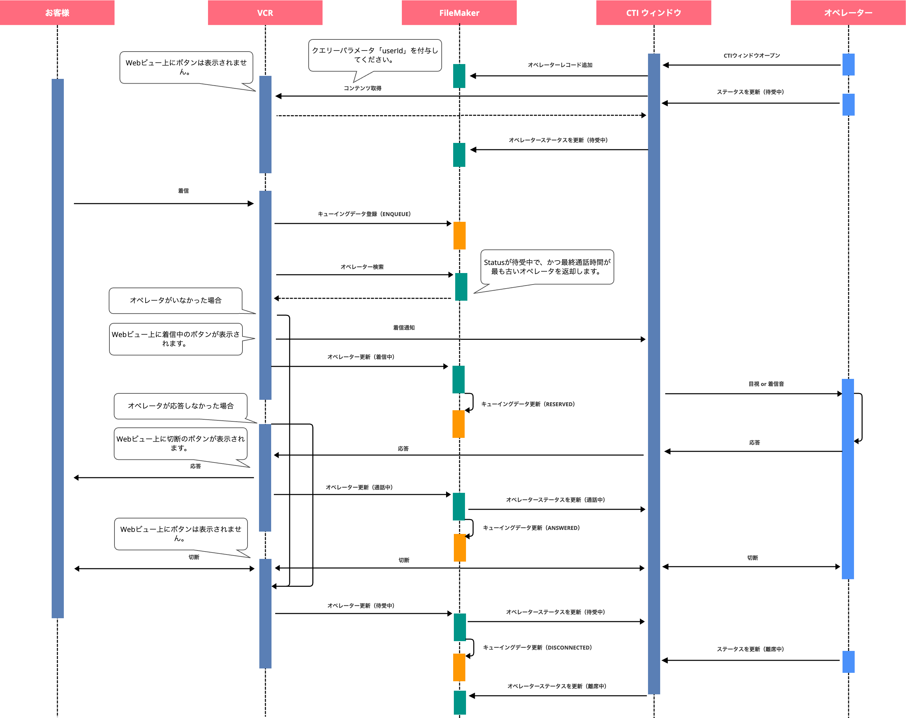

# Clarisコールセンタープロジェクト（Vonage側）

このプロジェクトは、Claris FileMaker と Vonage を組み合わせてコールセンターを作成するプロジェクトの Vonage 側の処理を実装したものです。

## プロジェクト構造

```sh
.
├── README.md                 # プロジェクトの説明ドキュメント
├── index.js                  # メインのアプリケーションコード
├── vcr-sample.yml           # Vonage Cloud Runtime設定のサンプル
├── vcr.yml                  # Vonage Cloud Runtime設定ファイル
├── package.json             # プロジェクトの依存関係定義
├── package-lock.json        # 依存関係の詳細なバージョン情報
├── build.sh                 # ビルドスクリプト
├── .gitignore              # Gitの除外設定
├── .vscode/                # VSCode設定ディレクトリ
├── node_modules/           # Node.jsの依存モジュール
└── public/                 # 静的ファイルディレクトリ
    ├── index.html          # オペレーター用Webインターフェース
    ├── ringtone.mp3        # 着信音ファイル
    ├── styles.css          # スタイルシート
    └── tmp/                # 一時ファイルディレクトリ
```

## 機能概要

このプロジェクトでは以下の機能を提供しています：

1. 電話着信処理
   - PSTN経由の着信処理
   - WebRTC経由の着信処理
   - オペレーターの自動振り分け

2. 通話管理
   - 通話の録音機能
   - 音声認識（文字起こし）機能
   - オペレーターのステータス管理

3. Claris FileMaker連携
   - 顧客情報の取得（フリガナ情報）
   - キューイングデータの管理
   - オペレーターのステータス管理

## シーケンス図



## 環境設定

### 環境変数の設定

1. `vcr-sample.yml`を`vcr.yml`にコピーします：

```bash
cp vcr-sample.yml vcr.yml
```

2. `vcr.yml`を開き、以下の環境変数を各自の環境に合わせて設定します：

```yaml
environment:
  - name: VONAGE_NUMBER
    value: "120XXXXXXXX"  # Vonageの電話番号
  - name: CLARIS_SERVER_URL
    value: "https://example.com/fmi/odata/v4/ClickToCall"  # Claris FileMaker ServerのURL
  - name: USER
    value: ""  # Claris FileMaker Serverのユーザー名
  - name: PASS
    value: ""  # Claris FileMaker Serverのパスワード
  - name: SERVER_URL
    value: "http://localhost:3000"  # このアプリケーションのサーバーURL
  - name: END_POINT_RECORDING
    value: "https://xxxxxx.apps.connect.claris.com/api/webhook/v1/voice/catch"  # 録音データのエンドポイント
  - name: END_POINT_TRANSCRIPTION
    value: "https://xxxxxx.apps.connect.claris.com/api/webhook/v1/transcription/catch"  # 音声認識データのエンドポイント
```

注意：

- `application-id`は、Vonage APIのアプリケーションIDに置き換えてください
- `VONAGE_NUMBER`は、Vonageで取得した電話番号を設定してください
- `CLARIS_SERVER_URL`は、Claris FileMaker ServerのOData APIのURLを設定してください
- `SERVER_URL`は、このアプリケーションがデプロイされるURLを設定してください
- `END_POINT_RECORDING`と`END_POINT_TRANSCRIPTION`は、Claris ConnectのWebhook URLを設定してください

## オペレーター用Webインターフェース

`public/index.html`は、オペレーターが使用するWebインターフェースを提供します。このインターフェースは以下の機能を提供します：

### 主な機能

- 電話発信機能
- 着信応答機能
- 通話切断機能
- 着信音の再生

### 使用方法

1. URLパラメータで以下の情報を指定してアクセスします：

   - `userId`: オペレーターID
   - `phone`: 発信先の電話番号（発信時のみ必要）

2. 画面のボタン操作：
   - 「発信」ボタン：指定された電話番号に発信
   - 「着信中...」ボタン：着信に応答
   - 「切断」ボタン：通話を終了

### 技術仕様

- Vonage Client SDKを使用したWebRTC通話
- Tailwind CSSによるUI実装
- 着信音の再生機能
- 通話状態に応じたUIの動的更新

## デバッグの開始方法

1. 左側の「Run and Debug」メニューを開きます。
2. 再生ボタンをクリックしてデバッガーを開始します。


## ブラウザでの確認方法

1. 下部パネルの「Terminal」タブを開きます。
2. デバッグリンクを開いてプロジェクトを確認できます。


## デプロイ方法

プロジェクトをデプロイする場合は、下部パネルの「Terminal」タブを開き、以下のコマンドを実行してください：

```sh
vcr deploy
```

Vonage Cloud Runtimeへのデプロイについての詳細は、[デプロイガイド](https://developer.vonage.com/vcr/guides/deploying)をご覧ください。

## APIエンドポイント

### 着信処理

- `POST /onCall`: 電話着信時の処理
- `POST /onEvent`: 通話イベント発生時の処理
- `POST /onEventRecorded`: 録音完了時の処理
- `POST /onEventTranscribed`: 音声認識完了時の処理

### ユーティリティ

- `POST /getKana`: 電話番号から顧客のフリガナを取得
- `GET /getToken`: WebRTC用のJWTトークンを取得
- `GET /_/health`: ヘルスチェック
- `GET /_/metrics`: メトリクス取得
