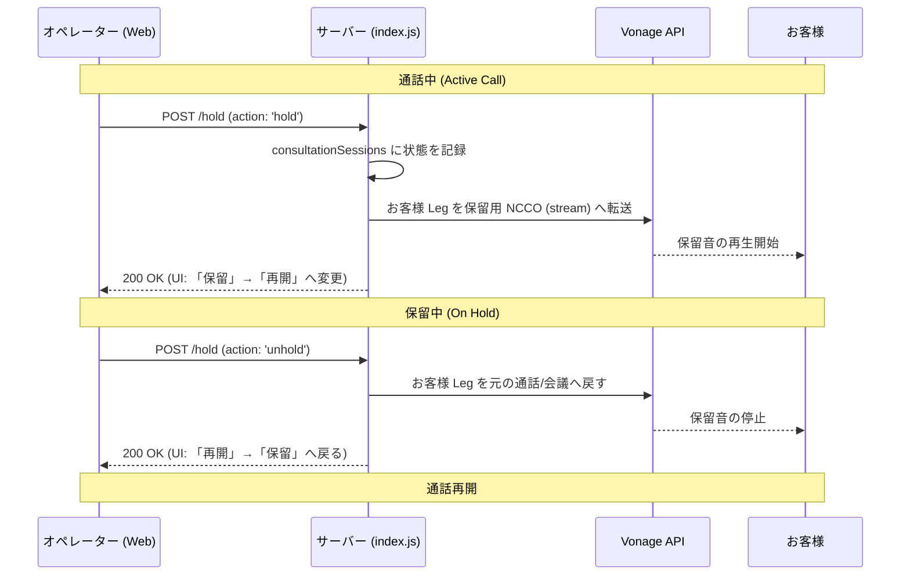
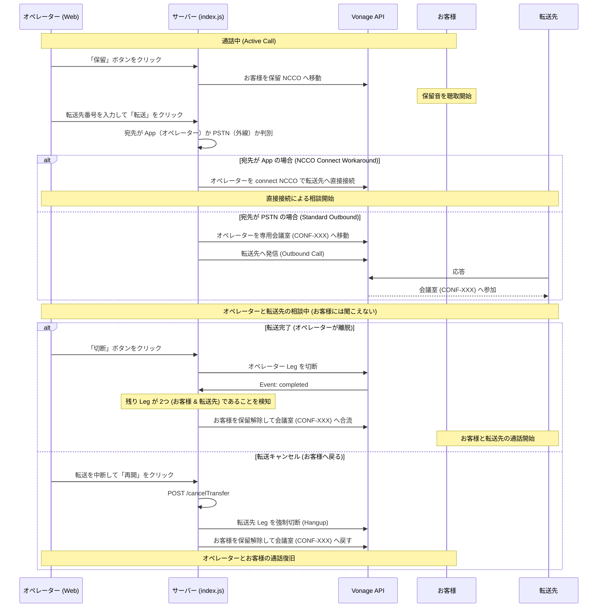
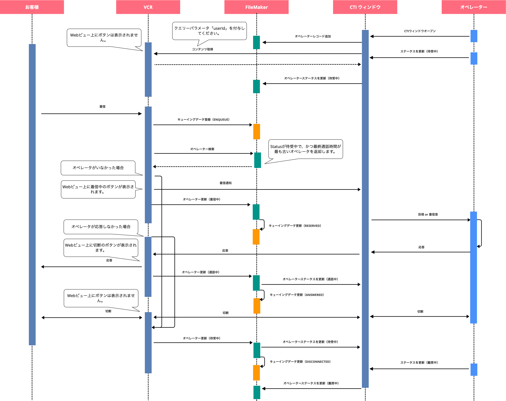
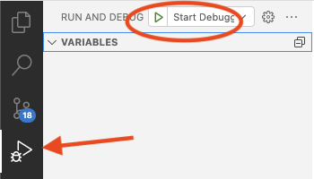
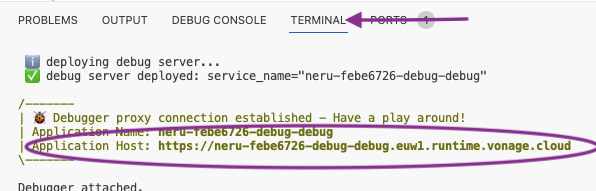

# Clarisコールセンタープロジェクト（Vonage側）

このプロジェクトは、Claris FileMaker と Vonage を組み合わせてコールセンターを作成するプロジェクトの Vonage 側の処理を実装したものです。

## プロジェクト構造

```sh
.
├── README.md                 # プロジェクトの説明ドキュメント
├── index.js                  # メインのアプリケーションコード
├── vcr-sample.yml           # Vonage Cloud Runtime設定のサンプル
├── vcr.yml                  # Vonage Cloud Runtime設定ファイル
├── package.json             # プロジェクトの依存関係定義
├── package-lock.json        # 依存関係の詳細なバージョン情報
├── build.sh                 # ビルドスクリプト
├── .gitignore              # Gitの除外設定
├── .vscode/                # VSCode設定ディレクトリ
├── node_modules/           # Node.jsの依存モジュール
└── public/                 # 静的ファイルディレクトリ
    ├── index.html          # オペレーター用Webインターフェース
    ├── ringtone.mp3        # 着信音ファイル
    ├── styles.css          # スタイルシート
    └── tmp/                # 一時ファイルディレクトリ
```

## 機能概要

このプロジェクトでは以下の機能を提供しています：

1. 電話着信処理
   - PSTN経由の着信処理
   - WebRTC経由の着信処理
   - オペレーターの自動振り分け

2. 通話管理
   - 通話の録音機能
   - 音声認識（文字起こし）機能
   - オペレーターのステータス管理

3. Claris FileMaker連携
   - 顧客情報の取得（フリガナ情報）
   - キューイングデータの管理（履歴保存、完了ステータスの更新）
   - オペレーターのステータス管理（待受中・着信中・通話中のリアルタイム同期）

## 詳細な通話フロー

システムの主要な通話制御フローについて説明します。

### 1. 通話保留・解除フロー

オペレーターがお客様との通話を一時的に保留し、保留音を流すフローです。


```mermaid
sequenceDiagram
    participant O as オペレーター (Web)
    participant S as サーバー (index.js)
    participant V as Vonage API
    participant C as お客様

    Note over O,C: 通話中 (Active Call)
    O->>S: POST /hold (action: 'hold')
    S->>S: consultationSessions に状態を記録
    S->>V: お客様 Leg を保留用 NCCO (stream) へ転送
    V-->>C: 保留音の再生開始
    S-->>O: 200 OK (UI: 「保留」→「再開」へ変更)

    Note over O,C: 保留中 (On Hold)

    O->>S: POST /hold (action: 'unhold')
    S->>V: お客様 Leg を元の通話/会議へ戻す
    V-->>C: 保留音の停止
    S-->>O: 200 OK (UI: 「再開」→「保留」へ戻る)
    Note over O,C: 通話再開
```

### 2. 相談転送（Warm Transfer）フロー

お客様を保留にした状態で転送先と相談し、その後「完全転送」または「転送キャンセル（復帰）」を行うフローです。


```mermaid
sequenceDiagram
    participant O as オペレーター (Web)
    participant S as サーバー (index.js)
    participant V as Vonage API
    participant C as お客様
    participant T as 転送先

    Note over O,C: 通話中 (Active Call)
    O->>S: 「保留」ボタンをクリック
    S->>V: お客様を保留 NCCO へ移動
    Note over C: 保留音を聴取開始

    O->>S: 転送先番号を入力して「転送」をクリック
    S->>S: 宛先が App（オペレーター）か PSTN（外線）か判別
    
    alt 宛先が App の場合 (NCCO Connect Workaround)
        S->>V: オペレーターを connect NCCO で転送先へ直接接続
        Note over O,T: 直接接続による相談開始
    else 宛先が PSTN の場合 (Standard Outbound)
        S->>V: オペレーターを専用会議室 (CONF-XXX) へ移動
        S->>V: 転送先へ発信 (Outbound Call)
        T->>V: 応答
        V-->>T: 会議室 (CONF-XXX) へ参加
    end
    Note over O,T: オペレーターと転送先の相談中 (お客様には聞こえない)

    alt 転送完了 (オペレーターが離脱)
        O->>S: 「切断」ボタンをクリック
        S->>V: オペレーター Leg を切断
        V->>S: Event: completed
        Note over S: 残り Leg が 2つ (お客様 & 転送先) であることを検知
        S->>V: お客様を保留解除して会議室 (CONF-XXX) へ合流
        Note over C,T: お客様と転送先の通話開始
    else 転送キャンセル (お客様へ戻る)
        O->>S: 転送を中断して「再開」をクリック
        S->>S: POST /cancelTransfer
        S->>V: 転送先 Leg を強制切断 (Hangup)
        S->>V: お客様を保留解除して会議室 (CONF-XXX) へ戻す
        Note over O,C: オペレーターとお客様の通話復旧
    end
```

#### チェーン切断（Chain Hangup）について
このシステムでは、転送完了後にお客様または転送先のどちらかが電話を切った際、残された一方が「一人で通話中」の状態にならないよう、自動的に残りのレグを切断する制御（連鎖切断）を実装しています。

## シーケンス図（簡易版）



## 環境設定

### 環境変数の設定

1. `vcr-sample.yml`を`vcr.yml`にコピーします：

```bash
cp vcr-sample.yml vcr.yml
```

2. `vcr.yml`を開き、以下の環境変数を各自の環境に合わせて設定します：

```yaml
environment:
  - name: VONAGE_NUMBER
    value: "120XXXXXXXX"  # Vonageの電話番号
  - name: CLARIS_SERVER_URL
    value: "https://example.com/fmi/odata/v4/ClickToCall"  # Claris FileMaker ServerのURL
  - name: USER
    value: ""  # Claris FileMaker Serverのユーザー名
  - name: PASS
    value: ""  # Claris FileMaker Serverのパスワード
  - name: SERVER_URL
    value: "http://localhost:3000"  # このアプリケーションのサーバーURL
```

注意：

- `application-id`は、Vonage APIのアプリケーションIDに置き換えてください
- `VONAGE_NUMBER`は、Vonageで取得した電話番号を設定してください
- `CLARIS_SERVER_URL`は、Claris FileMaker ServerのOData APIのURLを設定してください
- `SERVER_URL`は、このアプリケーションがデプロイされるURLを設定してください

## オペレーター用Webインターフェース

`public/index.html`は、オペレーターが使用するWebインターフェースを提供します。このインターフェースは以下の機能を提供します：

### 主な機能

- 電話発信機能
- 着信応答機能
- 通話切断機能
- 着信音の再生

### 使用方法

1. URLパラメータで以下の情報を指定してアクセスします：

   - `userId`: オペレーターID
   - `phone`: 発信先の電話番号（発信時のみ必要）

2. 画面のボタン操作：
   - 「発信」ボタン：指定された電話番号に発信
   - 「着信中...」ボタン：着信に応答
   - 「切断」ボタン：通話を終了

### 技術仕様

- Vonage Client SDKを使用したWebRTC通話
- Tailwind CSSによるUI実装
- 着信音の再生機能
- 通話状態に応じたUIの動的更新

## デバッグの開始方法

1. 左側の「Run and Debug」メニューを開きます。
2. 再生ボタンをクリックしてデバッガーを開始します。



## ブラウザでの確認方法

1. 下部パネルの「Terminal」タブを開きます。
2. デバッグリンクを開いてプロジェクトを確認できます。



## デプロイ方法

プロジェクトをデプロイする場合は、下部パネルの「Terminal」タブを開き、以下のコマンドを実行してください：

```sh
vcr deploy
```

Vonage Cloud Runtimeへのデプロイについての詳細は、[デプロイガイド](https://developer.vonage.com/vcr/guides/deploying)をご覧ください。

## APIエンドポイント

### 着信処理

- `POST /onCall`: 電話着信時の処理
- `POST /onEvent`: 通話イベント発生時の処理
- `POST /onEventRecorded`: 録音完了時の処理
- `POST /onEventTranscribed`: 音声認識完了時の処理

### 相談・転送関連

- `POST /hold`: 通話の保留・再開（action: 'hold' or 'unhold'）
- `POST /transfer`: 相談転送の開始（App宛て/PSTN宛ての自動判別）
- `POST /cancelTransfer`: 転送のキャンセルとお客様への復帰

### ユーティリティ

- `POST /getKana`: 電話番号から顧客のフリガナを取得
- `GET /api/users`: FileMaker から待受中のオペレーター一覧を取得
- `GET /getToken`: WebRTC用のJWTトークンを取得
- `GET /_/health`: ヘルスチェック
- `GET /_/metrics`: メトリクス取得

## 運用上の注意・トラブルシューティング

### ステータス管理の仕様
オペレーターのステータス（待受中・通話中など）は、Vonage のイベントと連動して FileMaker 側の `Operator_Status` テーブルを PATCH 更新します。
- **着信/呼出中**: `Status` を「着信中」に更新
- **応答**: `Status` を「通話中」に更新
- **切断/完了**: `Status` を「待受中」に更新し、同時に `IncomingNumber` と `Conversation_uuid` を空文字でクリアします。

### よくあるエラー
- **ERR_NGROK_3004**: ngrok ゲートウェイが不正な HTTP レスポンスを検知した際のエラーです。原因として、サーバー側での「多重レスポンス送信（res.json と res.sendStatus の重複など）」や、処理のクラッシュが挙げられます。
- **Type APP is not supported**: Vonage の一部の API エンドポイントで App ユーザーへの直接発信が制限されている際のエラーです。本システムでは `transfer` と `connect` NCCO を組み合わせたワークアラウンドでこれを回避しています。
